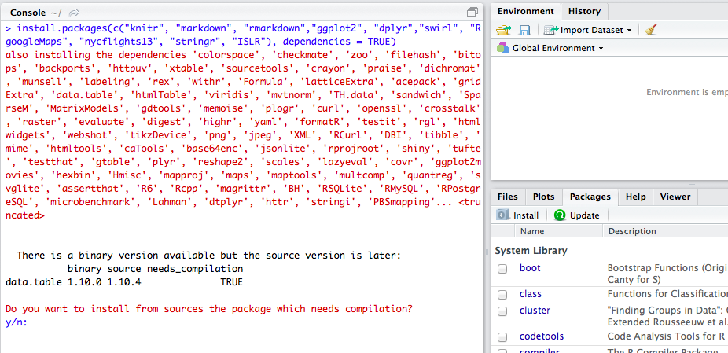

About this workshop
===================

Goals
-----

This 5 day workshop is intended to empower participants to perform serious statistical modeling with the R statistical software. It is an attempt to provide the solid foundation needed to begin using R in your data analysis and also give you an introduction to machine learning and data science. No previous experience is required, though some basic programming or data science exposure is helpful.

Agenda
======

Part I, INTRODUCTION TO DATA ANALYSIS WITH R
--------------------------------------------

### Day 1: Basic R programming

-   data types, vectors, matrices, strings, factors
-   control structures (for, if else, while)
-   functions, R markdown
-   basic plotting
-   computing with probabilities and distributions

### Day 2: Intermediate and advanced R programming topics

-   Performing descriptive statistics
-   Basic statistical tests (t-tests, single regression, correlation, ANOVA, logistic regression)
-   data manipulation
-   Data visualization with ggplot2

### Day 3 Advanced Data Analysis

-   multiple linear regression
-   ANOVA
-   Time series analysis
-   Panel data analysis
-   Bayesian statistics (empirical Bayes, Bayes factors)

PART II: INTRODUCTION TO MACHINE LEARNING
=========================================

### Day 4

-   What is statistical learning?
-   Estimation
-   Prediction accuracy vs. model interpretability
-   Supervised vs. unsupervised learning
-   Assessing model fit
-   Regression vs. classification problems
-   Linear regression (review), Regularization

-   Classification
-   Logistic regression (review)
-   Nearest Neighbor, Naïve Bayes, Linear discriminant analysis
-   Resampling Methods
-   Cross-validation
-   Bootstrapping

### Day 5

-   Non-linear Regression
-   Polynomial regression
-   splines, general additive models
-   Tree-based Methods
-   Decision trees, Random forests

-   Support Vector Machines
-   Unsupervised Learning
-   Principle component analysis
-   Clustering methods

------------------------------------------------------------------------

How you should prepare
----------------------

The workshop will contain plenty of hands-on, interactive explorations of real data sets with relevant spatial and temporal information.

You should install the [R](https://cran.r-project.org/) language and its popular IDE [RStudio](https://www.rstudio.com/products/rstudio/download/) prior.

### Required libraries

When you start RStudio you should see 3 panels, one of them the *Console* where you can type commands.

``` r
#mandatory
if (!require(pacman)) install.packages("pacman")
library(pacman)

p_load(ISLR,pander,nycflights13,dplyr,ggplot2,scales,partykit,dygraphs,nlme,mgcv,RgoogleMaps,texreg,tidyr, install = TRUE)
```

I would decline the compilation from source.

Be prepared to wait a while, lots of dependent packages are being installed as well.



### Download the data sets from github

-   [Titanic](data/TitanicTrain.csv)
-   [Global Temperature](data/global.dat)
-   [birth weights](data/BirthWeights.rda)
-   [S&P 500](data/sp500.rda)
-   [Advertising](data/Advertising.csv)

------------------------------------------------------------------------

### Links

[Berlin School of Economics and Law](http://www.hwr-berlin.de "BSEL Homepage")

[Prof. Markus Loecher](http://www.hwr-berlin.de/fachbereich-wirtschaftswissenschaften/kontakt/personen/kontakt-info/2184/ "ML official university link")

[my blog](https://blog.hwr-berlin.de/codeandstats/ "blog")

[my RgoogleMaps package](http://rgooglemaps.r-forge.r-project.org/ "RgoogleMaps on Rforge")
